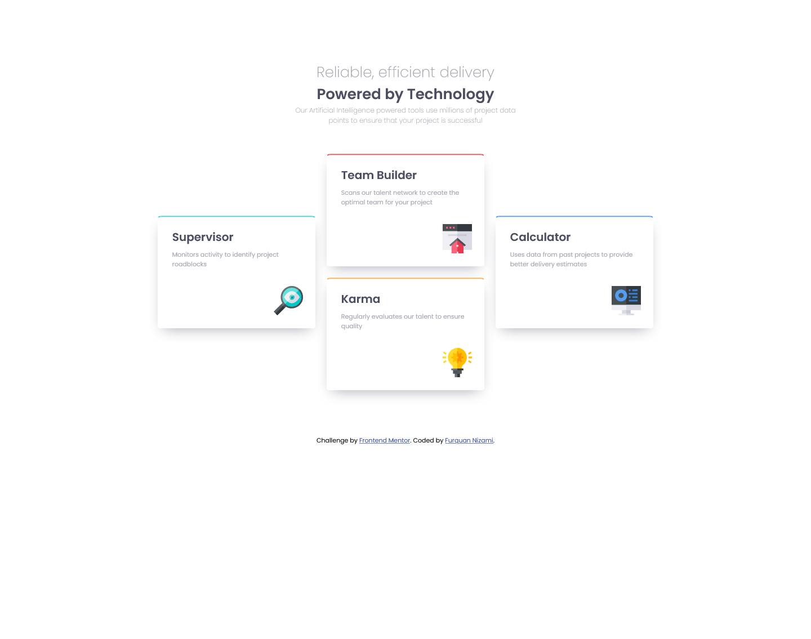

# Frontend Mentor - Four card feature section solution

This is a solution to the [Four card feature section challenge on Frontend Mentor](https://www.frontendmentor.io/challenges/four-card-feature-section-weK1eFYK).

## Table of contents

- [Overview](#overview)
  - [The challenge](#the-challenge)
  - [Screenshot](#screenshot)
  - [Links](#links)
- [My process](#my-process)
  - [Built with](#built-with)
  - [What I learned](#what-i-learned)
  - [Useful resources](#useful-resources)
- [Author](#author)
- [Acknowledgments](#acknowledgments)

## Overview

### The challenge

Users should be able to:

- View the optimal layout for the site depending on their device's screen size

### Screenshot

<<<<<<< HEAD

Screnshot of the web page is in the folder mentioned above
=======

Screnshots of the web page created.
>>>>>>> b8023f1bc81cd163f01a149baa48b7ef8f6fe36e

### Links

- Solution URL: [Add solution URL here](https://your-solution-url.com)
- Live Site URL: [Add live site URL here](https://your-live-site-url.com)

## My process

### Built with

- HTML5 markup
- CSS custom properties
- CSS Grid

### What I learned

I learned about the difference between rem and px unit and also about css grid and how to make a mobile version for a web page using the same.

### Useful resources

- [w3schools](https://www.w3schools.com/css/css_grid.asp) - I really like how each and every tags and elements are described in detail in w3schools. It really helps me to clearly understand.

## Author

- Frontend Mentor - [@furquan1011](https://www.frontendmentor.io/profile/hash-furquan)
- Twitter - [@NizamiFurquan](https://twitter.com/NizamiFurquan)

## Acknowledgments

This project helped me a lot in understanding the basics of HTML and CSS and also I was able to learn something new with this project.
